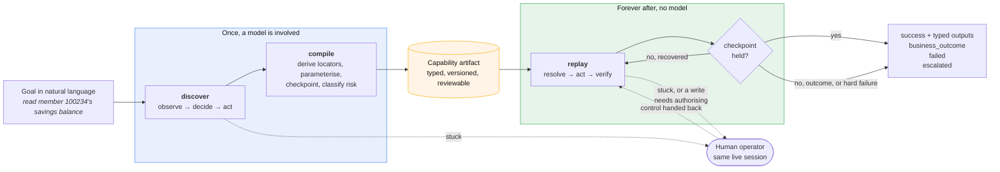

# Pantograph

*A pantograph is the linkage that traces a figure once and then reproduces it, mechanically and faithfully, as many times as you like.*

[](https://github.com/lakshdhamija/pantograph/actions/workflows/ci.yml)

A computer-use automation system for legacy back-office applications that have no API.

An LLM drives the application once to work out how a task is done. That run is compiled into a **typed, versioned capability artifact**. From then on the artifact is replayed **deterministically, with no model in the decision loop**, with typed inputs, typed outputs, declared business outcomes, bounded recoveries, guardrails, and a human-in-the-loop path when it gets stuck.

The design write-up is in [REPORT.md](REPORT.md). Worked runs, including failures, are in [evidence/](evidence/).



## Setup

Requires **Node ≥ 22.18** (or ≥ 23.6): those are the versions where Node runs TypeScript directly without a flag. No build step. Developed on Node 26. On an older 22.x you would need `node --experimental-strip-types`.

```bash
npm install
```

That installs three dependencies (`playwright`, `zod`, `@anthropic-ai/sdk`) and downloads Chromium (~180 MB, one time).

**No API key is needed for anything below except `ask`.** Discovery has **four planner implementations behind one interface**. The loop, the compiler and the evidence pipeline cannot tell them apart:

| | flag | needs a key |
|---|---|---|
| scripted | `--mock-llm` | no |
| **Groq** | `--planner groq` | `GROQ_API_KEY`, [free, no card](https://console.groq.com/keys). **The committed evidence was produced this way.** |
| GitHub Models | `--planner github` | `GITHUB_MODELS_TOKEN`, **being retired by GitHub**; the endpoint currently answers `410 github_models_retirement_brownout`. The preset is kept because the client is the generic OpenAI-compatible one, which is the point |
| Google Gemini | `--planner gemini` | `GEMINI_API_KEY`, [free](https://aistudio.google.com/apikey), but ~20 requests/day, enough for one capability rather than the whole demo |
| Anthropic | `--planner anthropic` (default) | `ANTHROPIC_API_KEY`, about 10¢ per run |
| OpenRouter / Together / Mistral / local Ollama | `--planner openrouter\|together\|mistral\|ollama` | provider key, or none for Ollama |

Everything from Groq downward shares one implementation (`openaiCompatible.ts`), because they all speak `POST /chat/completions`.

The scripted planner is a real implementation, not a bypass: every other component runs for real: the same guarded surface, perception, descriptor synthesis, compiler, replay engine and evidence pipeline. Only the "which control next" decision is scripted.

Every planner imports the same system prompt, the same tool contract and the same user turn from [`src/agent/llm/contract.ts`](src/agent/llm/contract.ts), so they cannot drift into different discovery quality; only the wire format differs.

`.env` is loaded natively and is gitignored. It does **not** override your shell: if `ANTHROPIC_API_KEY` is already exported, the shell value wins and `.env` is ignored.

Replay never calls a model at all, by design.

## Demo path

The fastest way to see everything:

```bash
npm run demo
```

About two minutes. It starts the fixture app, records three capabilities, approves them, prints the catalog, then runs twelve replays and a five-run stability sweep: success, two business outcomes, a rejected input, an injected core error, two recoveries, the approval gate with and without a human, and a second tenant. That is the 17 entries in `evidence/`, and it prints each command as it runs it.

`npm run demo -- --replays-only` skips discovery, reuses the committed artifacts and reproduces everything downstream of them. Discovery is the only part that needs a model.

With a key, `node scripts/demo.ts --live` records with a real model instead of the scripted planner. It uses whichever provider has a key, preferring the one with the most free-tier headroom: Groq, then Anthropic, then Gemini.

### Or step through it by hand

Start the target application in one terminal and leave it running:

```bash
npm run app
```

That is **CORETELLER**, a fixture standing in for a legacy core banking system: a real `<frameset>`, table-based layout, no test IDs, form controls named `f_mbr` with no accessible name, a `confirm()` dialog on submit, and faults you can arm on demand. See [Why a fixture](#why-a-fixture-and-not-a-public-site) below.

**Record a capability.** The model gets a goal and some parameters, drives the app, and the successful run is compiled into an artifact:

```bash
CORETELLER_PASSWORD=demo-only-not-a-secret node src/cli.ts discover --goal "Look up member 100234 and read their current regular share (savings) balance" --key member.read-savings-balance --title "Read a member's savings balance" --param memberId=100234 --param operatorId=teller01 --secret-env operatorPassword=CORETELLER_PASSWORD --mock-llm --rules read-savings-balance
```

This writes `artifacts/member.read-savings-balance@1.0.0.json`.

**Replay it deterministically, with a different member:**

```bash
CORETELLER_PASSWORD=demo-only-not-a-secret node src/cli.ts replay member.read-savings-balance --input memberId=100987 --input operatorId=teller01 --input-env operatorPassword=CORETELLER_PASSWORD
```

```
SUCCESS  member.read-savings-balance@1.0.0  (6771ms)

outputs:
  regularShareBalance = 611.07  [number]
```

A different member than the one recorded, and a `money` output that arrives as a number rather than the string `"611.07"` the screen actually contains. That block is copied from [evidence/06-replay-different-member.console.txt](evidence/06-replay-different-member.console.txt), which is the same command.

### Make it go wrong

Each of these is a different branch of the result contract, not a different flavour of crash:

```bash
export CORETELLER_PASSWORD=demo-only-not-a-secret

# A legitimate non-happy answer. status = business_outcome, code = MEMBER_NOT_FOUND.
node src/cli.ts replay member.read-savings-balance --input memberId=900001 --input operatorId=teller01 --input-env operatorPassword=CORETELLER_PASSWORD

# A malformed input. Rejected in ~1ms against the declared contract, before a browser opens.
node src/cli.ts replay member.read-savings-balance --input memberId=not-a-number --input operatorId=teller01 --input-env operatorPassword=CORETELLER_PASSWORD

# An injected core 500 two screens in. status = failed, class = app_error, with the core's own ORA reference.
node src/cli.ts replay member.read-savings-balance --input memberId=100234 --input operatorId=teller01 --input-env operatorPassword=CORETELLER_PASSWORD --arm app_error:2

# The session dies mid-flow. Recovers by running the sign-on capability on the same live session.
node src/cli.ts replay member.read-savings-balance --input memberId=100234 --input operatorId=teller01 --input-env operatorPassword=CORETELLER_PASSWORD --arm session_expiry:2
```

`--arm mode[:after[:count]]` injects a fault into the fixture out of band, so the replay's own request stream is unchanged and only the app misbehaves. Modes: `session_expiry`, `app_error`, `interstitial`, `validation`, `slow`.

### Watch a human take over

The write capability stops before its irreversible step and waits for a person:

```bash
node src/cli.ts replay member.open-sub-account --input memberId=100234 --input operatorId=teller01 --input-env operatorPassword=CORETELLER_PASSWORD --input productCode=S09 --input openingDeposit=100.00 --operator console
```

The command prints a URL carrying a bearer token generated for that run; the console answers `401` to every request without it. Open the URL it printed. Claim the intervention (that transfers the control lease to you) and you get a live view of the session the automation was driving, a form to drive it yourself, and the decisions available. Approve, and the automation finishes the write. Everything you do is written to the same evidence stream, attributed to `--operator-id` (your OS username by default) rather than to the role, because "who approved this write" is the first question anyone asks of an audit trail.

`--operator abort` (the default) refuses instead of waiting: correct for an unattended caller with nobody to ask. `--operator auto` uses a scripted operator, which is how the demo and the tests exercise the handoff. It will only approve an irreversible action because you asked for it by name on the command line.

Screenshots are masked before they exist, not blurred afterwards. The same `Redactor` that scrubs text decides which nodes to cover, so the two cannot drift apart, and the mask is installed on the surface itself, below the seam, so no caller can route around it. The escalation frames in `evidence/13`, `evidence/14` and `evidence/15` show it: the member's tax ID is a black box, and everything the operator needs in order to decide is still legible.

The console issues a bearer token per run, compared in constant time and checked before routing rather than inside each handler, so a route added later cannot be added unguarded.

Add `--headed` to any command to watch the browser.

### Ask for something in plain English

The end an AI agent actually sits at. The catalog is handed to a model as tools; it picks the capability that answers your sentence; that capability then replays with no model in the loop.

```bash
node src/cli.ts ask "what is the current savings balance for member 100987?" --input operatorId=teller01 --input-env operatorPassword=CORETELLER_PASSWORD
```

```
the agent chose:  member.read-savings-balance@1.0.0
  arguments it supplied: {"memberId":"100987","operatorId":"teller01"}
  supplied by the runtime: operatorPassword (never shown to the model)
  its reasoning: This is a balance lookup, so the read capability answers it.

replaying it deterministically -- no model from here on.

SUCCESS  regularShareBalance = 611.07  [number]
```

Two things the model is not trusted with: **credentials** are stripped from every tool schema before it sees them and merged in after it has chosen, and **approval** is not implied by selection; this path runs with `--operator abort`, so the agent that asked for a write is never the actor that authorises it.

`ask` is the one command that needs `ANTHROPIC_API_KEY`. It is wired to the Anthropic SDK directly rather than through the planner seam, which is a cut, not a design. It is also the one path with no committed evidence, for the same reason.

### Is it still working? (drift detection)

```bash
node src/cli.ts stability member.read-savings-balance --input memberId=100234 --input operatorId=teller01 --input-env operatorPassword=CORETELLER_PASSWORD --runs 5
```

Replays five times against fresh sessions and separates two things that get conflated:

```
STABILITY  member.read-savings-balance@1.0.0  5 runs  -> STABLE
  statuses:      success=5
  per run:
     1. success   6686ms  rungs [0,0,0,0,0,0,0]
     ...
  Every locator resolved on its preferred strategy in every run. No drift signal.
```

**Flaky**: identical inputs, different answers. Already a production problem. **Degrading**: every run passed, but locators are winning on later rungs of their ladder. Not yet a problem; the earliest warning that a screen moved.

### The catalog an agent would call

```bash
node src/cli.ts catalog              # human-readable, with lint warnings
node src/cli.ts catalog --tools      # Anthropic tool definitions, ready to paste
node src/cli.ts catalog --serve      # HTTP: GET /capabilities, GET /tools, POST /capabilities/<key>/invoke
```

The invoke endpoint's escalation stance is fixed by whoever starts the server, never read from the request. It defaults to `abort`, so a capability that needs a human stops rather than proceeding. The calling agent does not get to approve its own writes.

Capabilities are recorded as `draft`. The catalog will not advertise a draft as invocable, and the invoke endpoint refuses one, until a named reviewer approves it:

```bash
node src/cli.ts approve member.read-savings-balance --by "your name"
```

## Tests

```bash
npm test        # 99 tests, no browser and no API key needed
npm run typecheck
```

### What is and is not tested without a key

Worth being precise about, because "it needs an LLM" invites the assumption that nothing here is really verified:

| | key? | verified |
|---|---|---|
| 99 unit tests | no | yes |
| `replay` (all 17 replays the demo performs) | **never** | yes. Replay does not call a model at all; that is the product thesis, not a test shortcut |
| `discover --mock-llm` (3 runs) | no | yes |
| every provider's request/response path | no | yes, `tests/planner-wire.test.ts` points each real client at a local server speaking its API |
| **a live model's judgement** | yes | **yes**, all three committed discovery runs were driven by `openai/gpt-oss-120b` via Groq |

The committed discovery evidence is a **live** run: `evidence/0[123]-discover-*/transcript.json` holds what the model actually said, and all three CORETELLER artifacts record `provenance.planner: groq/openai/gpt-oss-120b`. Every artifact states what recorded it, and the other two say something else honestly: the Granite specialisation is hand-authored, and the storefront capability is scripted.

`npm run demo` reproduces everything with the scripted planner and no key. Both planners produce identical step ids, which is deliberate and is what makes the substitution safe (see REPORT.md).

Worth knowing if you re-record: the free tiers meter by *day*, not by minute. Groq allows 200k tokens a day and one discovery run is ~25k, so the full `--live` demo fits about seven times over, but a day of iterating will exhaust it, and the planner then refuses to retry rather than spending the remaining allowance on attempts that cannot succeed.

Every replay result carries `plannerCalls`, the number of provider requests made while it ran. It is 0 in all 17, and `tests/architecture.test.ts` asserts that nothing under `src/replay/` or `src/surface/` can reach a provider at all, so the central claim is checkable per run and enforced in CI, not merely stated here.

`tests/planner-wire.test.ts` is the interesting one. It asserts the request is well-formed, that all five tool schemas are valid JSON Schema with their `required` fields defined, that a `tool_use` response parses into the planner's own types, that the screen the model is shown is the same one the resolver sees, and that a sensitive parameter's value never reaches the wire even when the caller hands it one.

The targeting logic, the contracts, policy, redaction and tenant materialisation are all pure functions over an `Observation`, so they test without a browser.

`tests/invariants.test.ts` pins the properties this design depends on and that fail silently when violated: a locator must never key on the value it is reading, an `ordinal` rung must refuse once its real constraint has vanished, `element_absent` must not pass on an *ambiguous* resolution, the risk classifier must catch "post payment" and "withdrawal" without flagging "Avoid duplicate", an unattended operator must approve nothing, tenant inheritance must never downgrade a base capability's risk tier, and an operator's policy must keep every rule the deployment declared.

## The desktop seam is code, not a promise

`src/surface/desktop/macAxSurface.ts` implements the same `Surface` interface against the macOS accessibility API, and `tests/desktop.test.ts` takes a **descriptor recorded against the web fixture** and resolves it, unchanged, against a macOS AX tree:

```
✔ a web-recorded descriptor resolves against a desktop observation unchanged
✔ a cross-window relation is refused, exactly as a cross-frame one is
✔ the recorder synthesises a portable descriptor from a desktop node too
```

No Mac and no permissions needed for those, because the AX tree is a fixture. `act()` is not implemented and throws loudly: injecting synthetic events needs a native binding, which is a packaging problem rather than a design one. The point is that perception, targeting and the artifact contract port without change, and that claim is now checkable rather than asserted.

## Layout

```
src/surface/          THE SEAM. Perception and action in accessibility terms.
  types.ts              Observation, TargetDescriptor, Action. No DOM anywhere.
  resolve.ts            The locator ladder. Pure; no Playwright.
  guarded.ts            The chokepoint: control lease + policy + evidence.
  web/                  The only Playwright code in the project.
src/artifact/
  schema.ts             The capability contract (zod).
  describe.ts           Derives verified locator ladders from a perceived node.
  compile.ts            Discovery transcript -> artifact.
  profiles.ts           Per-vendor-product knowledge, shared by every capability.
  store.ts              Storage, tenant materialisation, specialisation lint.
src/replay/             The deterministic engine, its triage, its result contract.
  stability.ts          Multi-run flakiness and locator-degradation measurement.
src/agent/              The discovery loop and the planner boundary.
src/escalation/         Control lease, broker, operator console.
src/policy/ src/evidence/   Guardrails and redaction.
src/agent/llm/          Four planners behind one interface, and the prompt all four share.
src/capabilities/       The agent-facing catalog, and `ask` (model picks a capability).
src/surface/desktop/    Second implementation of the seam: macOS accessibility.
fixtures/legacy-bank/   CORETELLER, the target application.
```

## The same system on an application I did not write

```bash
npm run demo:public
```

Sauce Labs' Swag Labs storefront, published for automation practice. Not in CI: a green build should not depend on a third party's uptime, and re-running someone else's site on every push is rude. Evidence in [evidence/public-site/](evidence/public-site/).

|  | local fixture | public storefront |
|---|---|---|
| declared `portabilityFloor` | `any_surface` | `any_web` |
| why | no test IDs, so the ladder derives relational locators | test IDs present, and it uses one where nothing portable is unique |
| framesets | yes | no |
| error taxonomy | fully exercised, faults armed on demand | two real business outcomes, no injection possible |

Same recorder, same engine, neither told which it was looking at. One artifact, three products, three correct totals. The product-grid locator is `relative(anchor: text "{{inputs.productName}}")`, parameterised rather than pinned.

The drift signal fires here, which it does not on the fixture: `evidence/public-site/04-stability-three-runs` reports `DEGRADING` because step 4 resolves on rung 1 rather than rung 0 in every run. Nothing has failed, which is the point of separating "degrading" from "flaky".

It exercises four things the fixture cannot: a `data-test` attribute convention, so the cheap locator rung is present and has to be handled; an href-less anchor that strict ARIA computes as generic, which is why roles here describe affordances rather than the spec; an order total rendered `Total: $32.39`, which is why the compiler verifies each extraction against the value discovery observed; and a product-specific test id, which is why a locator that keys on a run parameter must be templated rather than pinned.

## Why a fixture as well

The interesting problems in this domain are the *exceptional* states: an expired session, a permission refusal, a surprise confirmation dialog, a validation rejection, an app error page. No public site lets you arm those on demand, and every public site has a cleaner DOM than the real target; most ship the test-id attributes that legacy enterprise software famously does not. A local fixture also means no terms-of-service question, no rate limits, and no real credentials or PII anywhere near this repo. Hence both: the fixture is where the error taxonomy is actually exercised, the storefront is where the recorder proves it was not shaped around an app I control.

CORETELLER is deliberately hostile in the specific ways that matter, and it serves two tenants (the same product, differently branded and relabelled) so cross-tenant reuse can be demonstrated rather than described.

All of its data is synthetic. The "tax IDs" exist so the redaction layer has realistic-looking regulated data to prove itself against.
