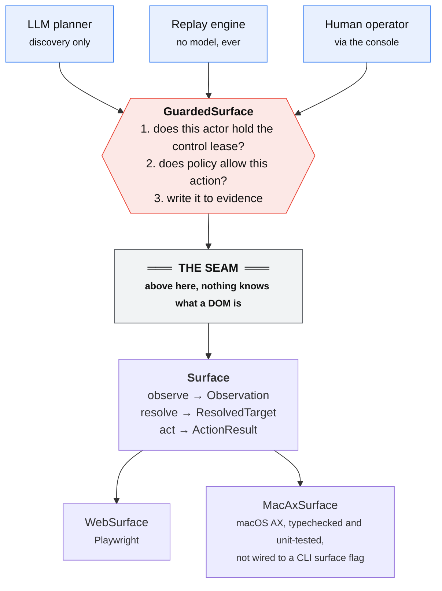
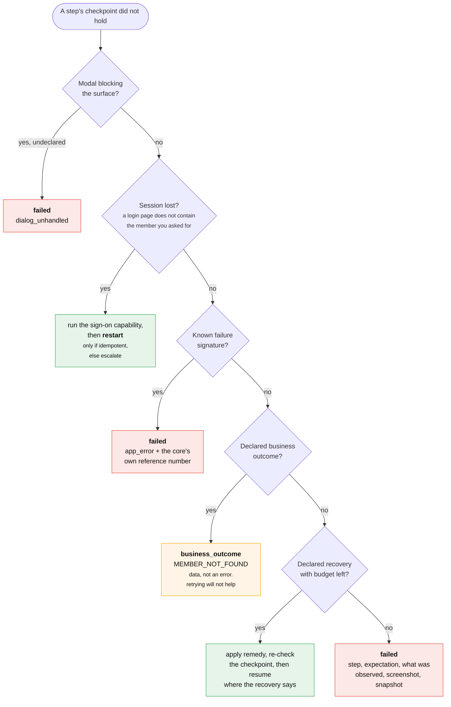

# Design write-up

Reasoning that did not fit here lives next to the code it explains: every module opens with why it is shaped the way it is. The two claims this write-up leans on hardest are assertions rather than prose, in `tests/architecture.test.ts`: nothing under `src/replay/` may import a model client, and no timer may appear there that is neither a poll nor a declared remedy.

## Architecture

**The seam is the load-bearing decision.** Above it nothing knows what a DOM is. An `Observation` is a flat list of `UiNode`, each carrying a role, an accessible name, a value, a container path and a bounding box. A `TargetDescriptor` says *"the textbox right of the cell reading Member Number"*. That vocabulary was chosen because it is the one description of a UI that exists everywhere: ARIA in a browser, `AXRole`/`AXTitle` on macOS, UIA on Windows. Artifacts describe intent, not implementation.

**One chokepoint.** `GuardedSurface` wraps the surface and enforces, in order: does this actor hold the control lease, does policy allow this, write both to evidence. The planner, the replay engine and the human operator each get their own over the *same* session. The broker holds the raw surface, because it mints one of these per operator, which is why anything that must apply to every actor is installed on the surface rather than on the wrapper. A guardrail the agent enforces on itself is a suggestion.

**The model points, the system describes.** The planner never writes a selector; it names a node by handle from the view the deterministic resolver will also see, and `describeNode` derives the durable locator. Artifact quality therefore stops depending on prompt luck, and the model cannot record a target replay will be unable to find.

TypeScript on Node 26 (no build step); Playwright for perception and input only, never its selector engine; Zod, for runtime validation and a JSON Schema projection from one definition; one process, because queues are the scaling infrastructure the brief says not to reward. The provider is not one of these choices: `Planner` has four implementations (Anthropic, Gemini, one generic OpenAI-compatible client covering Groq, GitHub Models, OpenRouter, Together, Mistral and Ollama, and a scripted stand-in) all sharing one prompt and one tool contract, so the seam is a demonstrated property rather than a claim. `pantograph ask "..."` closes the loop: a model reads the catalog and picks, then that capability replays with no model in it. Credentials never reach the model's tool schemas, and the path is pinned to `--operator abort`: selection is not authorisation.

## Artifact schema

A capability is a **contract**, not a macro. Four things beyond the obvious are first-class.

**Business outcomes are declared, with detectors.** `MEMBER_NOT_FOUND` has a code, a severity, a detector and its own typed data. The brief names conflating these with failures as the common mistake, so it is designed out at the type level: `ReplayResult` gives `success`, `business_outcome`, `escalated` and `failed` *different shapes*, and a caller matching on `status` cannot read `outputs` off a not-found.

**Recoveries are data.** Each declares a detector, a bounded remedy (wait, a short action sequence, running another capability, escalating), an attempt budget, and where to resume.

**Failure signatures** map a positively-identified broken screen to a real failure class. Without them an app rendering `CT-500 ORA-01722` reports as "expected text not found": true, useless, and indistinguishable from a locator bug.

**Locators are ladders with a portability floor.** Ordered rungs: `role_name` → `test_id` → `relative` (to a labelled anchor) → `text` → `ordinal` → `native_path`. Resolution stops at the first rung matching *exactly one* node; a rung matching three does not get to pick. Which rung won is returned, and winning late is recorded as `degraded`, the earliest drift signal, long before anything breaks. The declared floor is derived from the weakest rung actually used, so it can neither overstate portability nor forbid the rung the recorder chose.

Sensitivity (`public`/`pii`/`secret`) is enforced, not documentation. The compiler **refuses to emit**: a target that does not round-trip against its own observation, an irreversible step with no checkpoint, an extraction that cannot coerce the value discovery saw, a declared input the artifact never references, or a secret appearing anywhere in the output.

## Determinism & error handling

**Nothing waits on a clock.** Every gate and checkpoint polls to its own timeout, so a slow core is absorbed by the step budget and never reaches error handling. A wait is not a recovery; it is patience. Polling aborts early once the screen carries a definitive answer.

**Every step has a checkpoint**, derived from what actually changed: a modal the action raised, else a new location, else distinctive new text, else the control the next step needs. Exactly one: each extra clause is another way to reject a legitimate future screen.

**Locators describe structure, never record data.** A balance renders as `18,234.55`, so a naive recorder produces "the cell named 18,234.55", perfect on the recording machine, wrong for every other member, and if two share a balance it silently returns the *wrong cell*. Data-shaped names are disqualified as identities, forcing a structural anchor whose choice is verified by resolving it back. One exception, which took a second application to see: a locator *should* key on a run **parameter**, because the compiler templates it, so `relative(anchor: text "{{inputs.productName}}")` varies with the input.

**Triage before failure.** A failed checkpoint is a question, not a verdict. The order is fixed, and each rung outranks the next for a reason stated on it:

**Where to resume was the hard part.** Dismissing an interstitial that *covered* an already-loaded page completes the step, so retrying clicks a control that is gone; the engine re-checks the step's own checkpoint first. Re-authenticating lands on the home screen, so no single-step retry can work; that recovery declares `restart_capability`, honoured only when the capability is idempotent, which turns on one question: would running this twice write twice? A write flow that loses its session escalates instead. Time parked awaiting a human is excluded from the run budget. Counting deliberation against 120 seconds meant an operator taking three minutes had their approval honoured, the write performed, and the run then reported as a *retryable* timeout on a flow that must never re-run.

## Heterogeneity & multi-tenant

**A desktop surface, tested.** `MacAxSurface` implements the same interface against the macOS accessibility API, and `tests/desktop.test.ts` resolves a descriptor recorded on the *web* fixture against a macOS AX tree unchanged, with no Mac and no permissions needed. `containerPath` is the equivalence that makes it work: the frameset chain on web, the window chain on desktop, both answering "which independently-scoped region is this in", which is why the resolver refuses cross-container relations without knowing which surface produced them. `act()` throws rather than pretending; synthetic events need a native binding.

**An application I did not write.** A self-built fixture may have been shaped around the solution, so the same recorder also runs against a public storefront (`npm run demo:public`). The contrast is the substance: the fixture declares `any_surface`, because with no test IDs the ladder derives relational locators; the storefront declares `any_web`, because test IDs exist and it uses one where nothing portable is unique. It also exercises a `data-test` convention, an href-less control, and a label-prefixed money value, none of which the fixture has.

**Many tenants, one product.** *App profiles* hold what is true of the vendor product: session expiry, the interstitial, the `CT-500` page, the error banner every success condition excludes, its risk vocabulary. The compiler merges them into every capability recorded against that product, because rediscovering the same quirks across ~20 capabilities and hundreds of tenants gets them inconsistent thousands of times. The vocabulary has to be per-product: "Remove" is destructive on a core banking screen and reversible on a shopping cart.

*Specialisation is a patch, not a copy.* A tenant declares `extends` plus overrides; `granite.member.read-savings-balance` declares no steps at all, which the schema permits exactly when `tenant.extends` is set. The patch is keyed on step ids, so their stability is load-bearing. Ids slugged from the model's `intent` prose would not be stable, and every override would break the moment a base was re-recorded, which is the situation the mechanism exists for. They derive from the action and the target's identity instead, so a scripted planner and a live model produce identical ones. A base fix therefore reaches every tenant that has not overridden that point, a tenant's deviation is a diff, and drift stays local. Policy combines conservatively, taking max risk, OR-ing approval and AND-ing idempotent, and `lintSpecialisation` catches an incomplete override set at review time.

## Escalation & handoff

Underneath, this is mutual exclusion: two actors driving one browser is not co-browsing, it is a race inside a transaction. So control is an explicit **lease** with one holder, checked below every actor rather than inside any.

**Detecting stuck** is several conditions, not one heuristic: the planner gives up, the same action fails twice, a rule makes no progress, a budget runs out, a recovery exhausts its attempts, a non-idempotent capability needs a restart, or policy demands approval. All route through one broker, so stuck discovery and stuck replay give the operator the same experience.

**The handoff.** The broker captures a screenshot and a multi-frame snapshot *before* parking, then moves the lease to `nobody`, so automation fails closed rather than racing whoever picks it up. The request carries the capability, step, pending action, why it stopped, a screen summary and recent events. An operator claims it, taking the lease and a `GuardedSurface` over the **same** `BrowserContext`; their actions record as `human_action` in the same stream. Resolving returns the lease and settles the promise the engine is awaiting, so it resumes where it parked.

Operators may perform irreversible actions, since asking a human for permission once a human is acting is circular, while everything else the deployment declared still applies to them: its origins, its routes, its forbidden list. Their stance is *derived* from the deployment policy rather than rebuilt from the defaults, because a fresh engine from `DEFAULT_POLICY` would silently drop every deployment-specific rule on the one path where a human authorises a write. An `approve` issues a **one-shot grant** keyed to that action's fingerprint; a blanket flag would let one decision authorise every later write. Three modes: `console`, `auto` (scripted, for CI), and `abort`, which is the **default** and is chosen by whoever runs the process, never by the caller. That last point is the load-bearing one: an endpoint that read the stance from its request body would let the invoking agent authorise its own writes with a single JSON field.

## Safety

**Allowlist** of origins and per-origin routes, checked on every navigation and vetted against an artifact's entrypoint before it runs. The fixture's fault-injection endpoint is denied, so the agent cannot reach the lever that breaks its own app.

**Risk classified twice.** Actions are `safe`/`elevated`/`irreversible` from intent, target name, dialog message and URL, matched on word boundaries. The compiler stamps this onto every step so an artifact carries its own risk profile; the live check takes the **maximum** of live and declared, so recorded risk can be raised at runtime but never quietly lowered. Irreversible defaults to `require_approval`: blocking makes write capabilities impossible, allowing lets a model post to a system of record on its own judgement. A forbidden list (password resets, user administration, bulk export) is refused outright whoever asks.

**Data.** Declared sensitivity is authoritative: a `secret` is never logged and never shown to the model, and "never written" is enforced by the compiler scanning its own output. Pattern scanning is a second net for regulated data in *observed* content nobody declared. Both run at two chokepoints, the evidence writer and the discovery loop immediately before it hands a screen to a planner, and `manifest.json` tallies what was caught.

**Screenshots are redacted by the same policy as the text.** `GuardedSurface` asks the *same* `Redactor` which nodes it would rewrite and hands their handles to the surface, which covers those regions during capture rather than editing the page first or the image afterwards. One policy over both media, so they cannot drift apart. The mask is installed on the surface, below the seam, because the broker holds the raw surface by design and would otherwise route around it. It is driven by content rather than by the artifact, so it behaves the same during discovery, during replay and while a human is driving, and it covers a tax ID nobody declared an output for. A surface that cannot mask must refuse: the macOS one throws, because `screencapture` has no exclusion rectangles.

**The console authenticates.** It issues a bearer token per run, checked before routing rather than inside each handler, so a route added later cannot be added unguarded, and compared in constant time. Loopback binding was never authentication; it is an assumption about who else is on the host, and in a container that assumption is false. Actions are attributed to a named `--operator-id`, not to the role `console`, because "who approved this write" is the first question anyone asks of an audit trail.

**Scope of the controls.** Pattern scanning is a net, and it is tested against a corpus of regulated shapes *and* a corpus of near misses, because the costly error for a scanner is the false positive: it trains people to ignore the output, and through the compiler it also clears `idempotent`. Risk verbs are English, so another language or a button reading `OK` is per-profile configuration. A write performed over GET is caught by the route allowlist rather than by the verb list. The console's token authenticates a session; per-capability authorisation belongs to the SSO layer in front of it. Masking covers a node's whole bounding box, so a sensitive value inside a larger block takes the block with it, which is the safe direction.

## Cuts

**Now included, having been a cut.** A live model's judgement. All three committed discovery runs were driven by `openai/gpt-oss-120b`, and everything downstream calls no model at all, which every replay result records as `plannerCalls: 0`. Running against a real model is what surfaces the failure modes a scripted planner cannot: a turn that *succeeds* without advancing, and two rate-limit policies that need opposite handling, since a token bucket wants a retry and a spent daily allowance must not get one, and both arrive as HTTP 429.

**Cut deliberately.** A production desktop driver. Real co-browsing, out of scope per the brief. Persistence and scale: artifacts are files and interventions live in memory. Money as a float, which should be minor units. Profile merging is wholesale, so the sign-on capability advertises outcomes it cannot produce. Locator ladders derive from one observation, so a locator unique on this record's screen may be ambiguous on another's. And assisted LLM recovery on replay failure, which is the feature most likely to erode the determinism guarantee by degrees; the stability signal should be measured first.

**Next, in order.** (1) Drift detection as a product surface: `pantograph stability --runs N` separates flaky from degrading, but there is no time series per tenant per capability, which is the thing that turns "it broke" into "step 4 at Granite started resolving on a fallback rung three days ago". (2) Record against two records and intersect the descriptors, closing the single-observation gap cheaply. (3) A generated review UI, since JSON suits one reviewer and not a queue of them. (4) SSO and a per-capability role check in front of the console, which today authenticates a session but authorises nothing.
